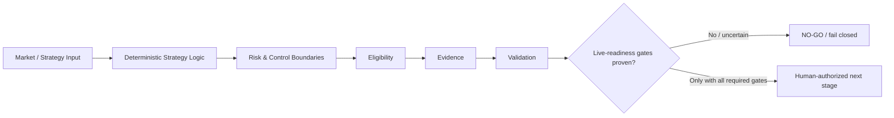

# Claire de Binare

Claire de Binare (CDB) is a deterministic, governance-first trading and validation system.
This is the public GitHub landing page. CDB operates in shadow/paper mode — live capital is not authorised.

[Deutsch] Claire de Binare (CDB) ist ein deterministisches, governance-first Trading-/Validation-System.
Diese Root-README ist die GitHub-Haupt-Landingpage. Der aktive Pfad bleibt Shadow/Paper-first; Live-Kapital ist nicht freigegeben.

## Portfolio Overview — Governance, Validation & Reliability

Claire de Binare is useful as a portfolio case **not because it is a trading bot**, but because it asks a harder systems question:

> **How do you stop a complex automated system from confusing “technically capable” with “proven safe to activate”?**

The repository separates engineering progress, validation evidence and live-capital authorization into different states. A component may be implemented, a board stage may be `trade-capable`, and individual validation phases may be complete while **Live Readiness still remains NO-GO**.

That separation is intentional. The system is designed to prefer a conservative stop over an unsupported production claim.

### Status model

| Layer | Meaning | Current portfolio interpretation |
|---|---|---|
| **Research / Engineering** | hypotheses, implementation and technical capability | active, evidence-producing system |
| **Control-Board Stage** | operational capability classification | `trade-capable` in the Board context |
| **Validation** | tests, replay, shadow, soak/chaos and evidence contracts | several phases evidenced as DONE/PASS |
| **Live Readiness** | separate authorization question for real-capital exposure | independent from Board stage |
| **LR-050** | live-capital canary gate | **NO-GO / fail-closed** |

Authoritative current status remains the linked Live-Readiness and Control-Register SSOTs below. This overview does not replace them and does not authorize live trading.

### Simplified control flow



### What this project demonstrates

- **Deterministic systems:** explicit state and reproducible decision paths instead of opaque activation.
- **Evidence-based validation:** tests, replay, shadow, soak and audit artifacts are treated as proof inputs, not decoration.
- **Fail-closed behavior:** missing, stale or insufficient evidence does not silently become permission.
- **Risk boundaries:** technical capability is kept separate from authority to expose real capital.
- **Auditability:** status and decisions are anchored to explicit documents, evidence and tracked gates.
- **Explicit uncertainty:** a partial PASS does not get promoted into a broader safety claim.

### My role / AI-assisted development

My core contribution is at the **system, governance and validation-design layer**:

- defining boundaries and non-negotiable safety states,
- structuring requirements and validation gates,
- separating engineering capability from live-readiness authority,
- orchestrating AI-assisted implementation and review work,
- interpreting evidence and keeping unsupported claims fail-closed.

A substantial part of implementation is AI-assisted. This repository should therefore **not** be read as a claim that I manually authored every line, nor as proof that I am a quantitative ML researcher or senior trading engineer. It is evidence of systems thinking, governance design, requirements, validation and AI-native delivery.

For the recruiter-facing case narrative, see [Portfolio Case Study](docs/PORTFOLIO_CASE_STUDY.md).

---

## Start Here

- [CDB Strategic Idea Lab](docs/strategy/CDB_STRATEGIC_IDEA_LAB.md) — public strategy and architecture drafts, discussion space, and creative exploration around CDB's future-state concepts. Ideas, critique, and suggestions are welcome.
- Neue Entwickler: [`DEVELOPER_ONBOARDING.md`](DEVELOPER_ONBOARDING.md)
- Onboarding-Docs: [`docs/onboarding/README.md`](docs/onboarding/README.md)
- Kurzer Docs-Index: [`docs/index.md`](docs/index.md)
- Agenten-Bootloader: [`AGENTS.md`](AGENTS.md) -> [`agents/AGENTS.md`](agents/AGENTS.md)
- Repo Brain / Context Intelligence: [`docs/surrealdb/README.md`](docs/surrealdb/README.md)
- GitHub-Control-Plane-Unterdokument: [`.github/CONTROL_PLANE.md`](.github/CONTROL_PLANE.md)
- CDB Glossary: [`docs/onboarding/cdb_glossary.md`](docs/onboarding/cdb_glossary.md)
- Repo-/Engineering-Ledger: [`CURRENT_STATUS.md`](CURRENT_STATUS.md)
- Support: GitHub Sponsors is configured via [`.github/FUNDING.yml`](.github/FUNDING.yml) for people who want to support ongoing development.

## Community & Governance

- [Contributing](CONTRIBUTING.md) — development workflow, tests, and contribution rules
- [Code of Conduct](CODE_OF_CONDUCT.md) — community standards (Contributor Covenant 3.0)
- [License](LICENSE) — MIT License
- [Security Policy](.github/SECURITY.md) — private vulnerability reporting (no public security issues)

## Safety / LR Status

- **Control-Board Stage:** `trade-capable` (Board-Kontext, nicht LR-Freigabe)
- **Live-Readiness Verdict:** **NO-GO** (SSOT: `docs/live-readiness/LR-AUDIT-STATUS-2026-03-05.md`)
- **LR-050 (P5 / Live-Capital):** **NO-GO** — fail-closed; Planning-SSOTs geliefert, Runtime-/Human-Gates offen (SSOT: `docs/live-readiness/LR-050-FINAL-RECONCILE.md`)
- **Context / MCP / DB posture:** `PERSIST_ALLOWED=False`, `MUTATION_ALLOWED=False`; managed/non-local runtime **NOT ACTIVATED**
- **Status-Trennung bleibt hart:**

| Quelle | Zweck |
|---|---|
| `docs/runbooks/CONTROL_REGISTER.md` | Board-Stage und operativer Fokus |
| `CURRENT_STATUS.md` | Repo-/Engineering-Ledger |
| `docs/live-readiness/LR-AUDIT-STATUS-2026-03-05.md` | Echtgeld Go/No-Go |
| `docs/live-readiness/LR-050-FINAL-RECONCILE.md` | LR-050 P5-Verdikt und offene Live-Capital-Blocker |

Stage und LR sind orthogonale Systeme: `trade-capable` autorisiert kein Live-Trading.

## New Developer Entry

- [`docs/onboarding/DEVELOPER_VISUAL_START_HERE.md`](docs/onboarding/DEVELOPER_VISUAL_START_HERE.md) - visueller Developer-Start (Mermaid-Flow, Beispiele, Vorlagen)
- [`docs/onboarding/README.md`](docs/onboarding/README.md) - Onboarding-Bereichsindex (Templates, Examples, Flows)
- [`DEVELOPER_ONBOARDING.md`](DEVELOPER_ONBOARDING.md) - lokales Setup, Secrets, Stack-Bootstrap
- [`docs/index.md`](docs/index.md) - kuerzester aktiver Docs-Einstieg
- [`services/README.md`](services/README.md) - Service-Grenzen und Topologie
- [`tests/README.md`](tests/README.md) - Test-Taxonomie und Einstiege
- [`tools/README.md`](tools/README.md) - lokale Helfer, PowerShell Front Door, Diagnosepfade

## Agent Entry

- `/onboarding` — schnellster Discovery-Einstieg fuer frische Agenten (Skill: `.opencode/skills/onboarding/`)
- Bootloader-Reihenfolge: [`AGENTS.md`](AGENTS.md) -> [`agents/AGENTS.md`](agents/AGENTS.md) -> [`agents/OPEN_CODE_AGENTS.md`](agents/OPEN_CODE_AGENTS.md)
- Status-Surfaces zuerst getrennt lesen: [`docs/runbooks/CONTROL_REGISTER.md`](docs/runbooks/CONTROL_REGISTER.md), [`CURRENT_STATUS.md`](CURRENT_STATUS.md), [`docs/live-readiness/LR-AUDIT-STATUS-2026-03-05.md`](docs/live-readiness/LR-AUDIT-STATUS-2026-03-05.md)

## Repo Brain / Context Intelligence

- Context-/MCP-Docs-Index: [`docs/surrealdb/README.md`](docs/surrealdb/README.md)
- Read-only Preflight fuer lokale Context-Tooling-Pruefung: `make context-doctor`
- Default posture auf `main`: `PERSIST_ALLOWED=False`, `MUTATION_ALLOWED=False`
- GitHub-/Repo-Live-Wahrheit gewinnt gegen Brain-/Ledger-Claims; LR bleibt `NO-GO`

## Current-main Snapshot

<!-- cdb:status-freshness header-date=2026-08-08 -->
**Stand 2026-08-08.**
<!-- cdb:live-claim type=main_sha value=d0e9b871 -->
<!-- cdb:live-claim type=issue_state issue=4411 state=closed -->
<!-- cdb:live-claim type=issue_state issue=4289 state=closed -->
<!-- cdb:live-claim type=issue_state issue=4257 state=closed -->
<!-- cdb:live-claim type=issue_state issue=4258 state=closed -->
<!-- cdb:live-claim type=issue_state issue=2513 state=open -->
<!-- cdb:live-claim type=issue_state issue=4293 state=closed -->
Auf `origin/main` (`d0e9b871`) sind die juengsten relevanten Merge-Cluster u. a.:

- **#4411 Final-Head approval pipeline reconciliation:** **MERGED/CLOSED** via PR [#4413](https://github.com/jannekbuengener/Claire_de_Binare/pull/4413) @ `d0e9b871`.
- **Hermes app mint/write-path ([#4289](https://github.com/jannekbuengener/Claire_de_Binare/issues/4289) / PR [#4344](https://github.com/jannekbuengener/Claire_de_Binare/pull/4344)):** **MERGED** @ `43401302` (ancestor of tip). Issue `#4289` **CLOSED**.  <!-- pragma: allowlist secret -->
- **Security Backlog Reconciliation ([#2513](https://github.com/jannekbuengener/Claire_de_Binare/issues/2513) / PR [#4303](https://github.com/jannekbuengener/Claire_de_Binare/pull/4303)):** **MERGED** @ `312d12e0` (ancestor of tip). Offene Security-Issues bleiben Upstream-HOLDs (geparkt bis FixedVersion). Meta `#2513` bleibt Tracker.
- **ACP E2E Pilot Foundation ([#4258](https://github.com/jannekbuengener/Claire_de_Binare/issues/4258) / PR [#4301](https://github.com/jannekbuengener/Claire_de_Binare/pull/4301)):** **MERGED** @ `abf997d5` (mock-first). Issue `#4258` **CLOSED** (live GitHub). Dedicated PR [#4302](https://github.com/jannekbuengener/Claire_de_Binare/pull/4302) remains historical delivery evidence (`Refs` only; kein zweiter Cursor-Create ohne neues Human-GO).
- **PR Approval Context ([#4257](https://github.com/jannekbuengener/Claire_de_Binare/issues/4257) / PR [#4300](https://github.com/jannekbuengener/Claire_de_Binare/pull/4300)):** **MERGED** @ `a4cfb8a8` (ancestor of tip).
- **ACP dispatcher residuals ([#4293](https://github.com/jannekbuengener/Claire_de_Binare/issues/4293) / PR [#4297](https://github.com/jannekbuengener/Claire_de_Binare/pull/4297)):** **MERGED** @ `d4704025` (ancestor of tip).
- **Area Entry Link Canon ([#4294](https://github.com/jannekbuengener/Claire_de_Binare/issues/4294)/[#4296](https://github.com/jannekbuengener/Claire_de_Binare/issues/4296) / PR [#4295](https://github.com/jannekbuengener/Claire_de_Binare/pull/4295)):** **MERGED** — README Area Entry Link Rule + active README reconcile @ `365f50b9`.
- **Repository consolidation wave:** [#4286](https://github.com/jannekbuengener/Claire_de_Binare/pull/4286) ACP batch, [#4162](https://github.com/jannekbuengener/Claire_de_Binare/pull/4162) Grafana 13.1.1, [#4245](https://github.com/jannekbuengener/Claire_de_Binare/pull/4245) CVE HOLD, [#4246](https://github.com/jannekbuengener/Claire_de_Binare/pull/4246) PG15 preflight, [#4244](https://github.com/jannekbuengener/Claire_de_Binare/pull/4244) Dependabot facts, [#4243](https://github.com/jannekbuengener/Claire_de_Binare/pull/4243) dataset fingerprints — squash-merged (prior tip `fce4c754`, superseded by Hermes tip).
- **Validation Pilot Spec ([#4272](https://github.com/jannekbuengener/Claire_de_Binare/issues/4272) / PR [#4292](https://github.com/jannekbuengener/Claire_de_Binare/pull/4292)):** **MERGED** — prior tip cluster (historical relative to consolidation tip).
- **Fast-CI Slice Gates ([#4204](https://github.com/jannekbuengener/Claire_de_Binare/issues/4204) / PR [#4236](https://github.com/jannekbuengener/Claire_de_Binare/pull/4236)):** **CLOSED/MERGED** — Versionierte Slice-Policy, fail-closed unbekannte Pfade, Timing-Evidence.
- **PR-Router Live-Konventionen ([#4228](https://github.com/jannekbuengener/Claire_de_Binare/issues/4228) / PR [#4231](https://github.com/jannekbuengener/Claire_de_Binare/pull/4231)):** **CLOSED/MERGED** — Policy/Matcher an reale Titel-Token und `scope:*`/`type:*` Labels angeglichen.

<!-- cdb:live-claim type=issue_state issue=1445 state=open -->
Operatives Cockpit: [Issue #1445](https://github.com/jannekbuengener/Claire_de_Binare/issues/1445) (offen). Der Nav-/Snapshot-Reconcile [#3995](https://github.com/jannekbuengener/Claire_de_Binare/issues/3995) (PR [#4018](https://github.com/jannekbuengener/Claire_de_Binare/pull/4018)) und der Community-Health-Reconcile [#4005](https://github.com/jannekbuengener/Claire_de_Binare/issues/4005) (PR [#4024](https://github.com/jannekbuengener/Claire_de_Binare/pull/4024)) sind abgeschlossen. Vollstaendiges Session-Ledger: [`CURRENT_STATUS.md`](CURRENT_STATUS.md).

Dieser Abschnitt ist ein Live-Claim und wird von `python -m tools.validate_status_freshness` semantisch geprueft; die Markerkonvention steht in [`docs/meta/REPOSITORY_CANON.md`](docs/meta/REPOSITORY_CANON.md).

LR bleibt **NO-GO** — SSOT: [`docs/live-readiness/LR-AUDIT-STATUS-2026-03-05.md`](docs/live-readiness/LR-AUDIT-STATUS-2026-03-05.md).

## Docs / Canonical Entrypoints

1. [`docs/runbooks/CONTROL_REGISTER.md`](docs/runbooks/CONTROL_REGISTER.md)
2. [GitHub Issue #1445](https://github.com/jannekbuengener/Claire_de_Binare/issues/1445) (inkl. neuestem Wochenkommentar)
3. [`CURRENT_STATUS.md`](CURRENT_STATUS.md)
4. [`docs/live-readiness/LR-AUDIT-STATUS-2026-03-05.md`](docs/live-readiness/LR-AUDIT-STATUS-2026-03-05.md)
5. [`docs/meta/REPOSITORY_CANON.md`](docs/meta/REPOSITORY_CANON.md)
6. [`agents/AGENTS.md`](agents/AGENTS.md)
7. [`docs/index.md`](docs/index.md)
8. [`DEVELOPER_ONBOARDING.md`](DEVELOPER_ONBOARDING.md)

## Tooling / Tests / Services

- Tooling: [`tools/README.md`](tools/README.md)
- Services: [`services/README.md`](services/README.md)
- Tests: [`tests/README.md`](tests/README.md)

- [`core/`](core/README.md) — gemeinsame Domain-/Contract-Logik
- [`services/`](services/README.md) — laufende Runtime-Services (Signal/Risk/Execution/etc.)
- [`infrastructure/`](infrastructure/README.md) — Compose, DB, Monitoring, Hermes, SurrealDB (Einstieg)
- [`infrastructure/compose/`](infrastructure/compose/README.md) — Compose-Canon (`compose.blue.yml` + `compose.red.yml`)
- [`config/`](config/README.md) — versionierte Repo-Konfiguration
- [`config/arvp/`](config/arvp/README.md) — ARVP-Kampagnen und Compose-Overrides
- [`.github/governance/`](.github/governance/README.md) — Governance-Gates und Action-Inputs (Area-README)
- [`docs/runbooks/`](docs/runbooks/README.md) — operative Runbooks inkl. Control Register
- [`docs/live-readiness/`](docs/live-readiness/README.md) — LR-Audit- und Gate-Artefakte
- [`docs/evidence/`](docs/evidence/README.md) — geprüfte, versionierte Nachweise; neue Ausgaben entstehen unter `artifacts/`
- [`knowledge/`](knowledge/README.md) — aktive Knowledge-/Governance-Flaeche
- [`tools/`](tools/README.md) — PowerShell Front Doors und Ops-Helfer
- [`tests/`](tests/README.md) — Unit/Integration/E2E/Replay/Chaos

## Dev / Test (CI mode, no containers)

First-time Python setup (matches CI):

```bash
pip install -r requirements.txt -r requirements-dev.txt -r requirements-mcp.txt
```

See [`DEVELOPER_ONBOARDING.md`](DEVELOPER_ONBOARDING.md) for the full local setup path.

```bash
make test                    # unit + integration
ruff check .                 # CI-required lint
pytest -q -k "not test_mcp_time_server_runtime"   # canonical CI pytest slice
```

Coverage gate (optional locally): `make test-coverage` (80% threshold). E2E und `local_only` brauchen laufenden BLUE+RED-Stack.

## Runtime / Ops Entry

Windows/PowerShell v1 Front Door:

```powershell
.\tools\cdb.ps1 secrets init
.\tools\cdb.ps1 runtime up
.\tools\cdb.ps1 stack verify
.\tools\cdb.ps1 runtime smoke
```

Compose Runtime Canon:

```bash
docker compose -f infrastructure/compose/compose.blue.yml up -d
docker compose -f infrastructure/compose/compose.red.yml up -d
```

Docker CI Lab Baseline:

```bash
docker compose -f infrastructure/compose/base.yml -f infrastructure/compose/test.yml up --abort-on-container-exit
```

## .github Control Plane

- Landing-page-Regel: diese Root-README bleibt die Repo-Front-Door.
- Preserved control-plane doc: [`.github/CONTROL_PLANE.md`](.github/CONTROL_PLANE.md)
- Deep-dive runbooks: [`docs/runbooks/GITHUB_CONTROL_PLANE_RUNBOOK.md`](docs/runbooks/GITHUB_CONTROL_PLANE_RUNBOOK.md) and [`docs/runbooks/GITHUB_WORKFLOW_REGISTER.md`](docs/runbooks/GITHUB_WORKFLOW_REGISTER.md)

## Navigation

- [`docs/navigation/mcp-navpack/ENTRYPOINTS.yaml`](docs/navigation/mcp-navpack/ENTRYPOINTS.yaml)
- [`docs/navigation/mcp-navpack/CHEATSHEET.md`](docs/navigation/mcp-navpack/CHEATSHEET.md)
- [`docs/meta/REPOSITORY_CANON.md`](docs/meta/REPOSITORY_CANON.md)
- [`docs/meta/ROOT_INFORMATION_ARCHITECTURE.md`](docs/meta/ROOT_INFORMATION_ARCHITECTURE.md)

## Boundary

Archiv-/Snapshot-Flaechen (`docs/archive/**`, `knowledge/archive/**`) sind historischer Rueckgriff und kein aktiver Pflegepfad.
